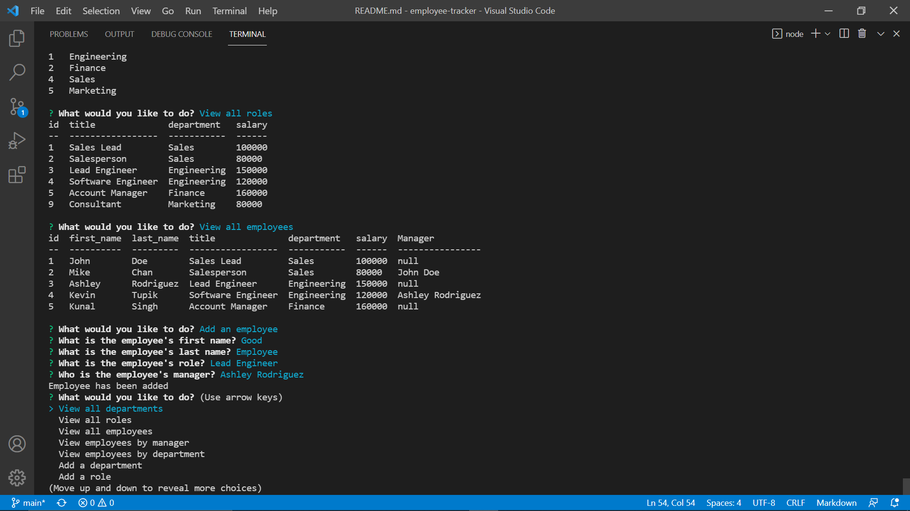

# Employee Tracker
  
[](https://opensource.org/licenses/Apache-2.0)

## Description

This application takes the employee database given and can create, read, update, and delete from it. It has the functionality to view all departments, roles, and employees in the database, and it can view employees separately by department and managers. Different departments, roles, and employees can be added to the database. An employee's role and manager can be updated once they are entered into the system. Any department, role, or employee can also be deleted from the system. Roles and departments have a cascading setting that will cause all roles in the department to also be deleted, as well as any employees in a role that has been deleted. Be sure to update employee roles as desired before deleting any roles or departments. There is also a function to view utilized budgets by department.

## Table of Contents
* [Installation](#installation)
* [Usage](#usage)
* [License](#license)
* [Contributing](#contributing)
* [Tests](#tests)
* [Questions](#questions)
   
<a name="installation"></a>
## Installation

Users can clone this application from the github and run on node.js.

<a name="usage"></a>
## Usage

The application will prompt the user with a list of options and ask the user "What would you like to do?". There is an option for every feature that can be utilized as descibed in the project description. Making a selection will either prompt the user for further information or, if no more information is needed, will display the information desired. Once all necessary information has been input, then the application will create, read, update, or delete the desired content and the user will be returned to the initial prompt to choose another option.

# Employee Tracker
  
[](https://opensource.org/licenses/Apache-2.0)

## Description

This application takes the employee database given and can create, read, update, and delete from it. It has the functionality to view all departments, roles, and employees in the database, and it can view employees separately by department and managers. Different departments, roles, and employees can be added to the database. An employee's role and manager can be updated once they are entered into the system. Any department, role, or employee can also be deleted from the system. Roles and departments have a cascading setting that will cause all roles in the department to also be deleted, as well as any employees in a role that has been deleted. Be sure to update employee roles as desired before deleting any roles or departments. There is also a function to view utilized budgets by department.

## Table of Contents
* [Installation](#installation)
* [Usage](#usage)
* [License](#license)
* [Contributing](#contributing)
* [Tests](#tests)
* [Questions](#questions)
   
<a name="installation"></a>
## Installation

Users can clone this application from the github and run on node.js. Install proper dependencies by running the commands:
```
npm init
npm i inquirer mysql2 console.table
```

<a name="usage"></a>
## Usage

The application will prompt the user with a list of options and ask the user "What would you like to do?". There is an option for every feature that can be utilized as descibed in the project description. Making a selection will either prompt the user for further information or, if no more information is needed, will display the information desired. Once all necessary information has been input, then the application will create, read, update, or delete the desired content and the user will be returned to the initial prompt to choose another option.

https://watch.screencastify.com/v/D4N25d6J6Zi6LS27ZrIh
[](https://watch.screencastify.com/v/D4N25d6J6Zi6LS27ZrIh)


<a name="license"></a>
## License

This project is licensed under the Apache 2.0 license.
undefined

<a name="contributing"></a>
## Contributing

Open source

<a name="tests"></a>
## Tests
To run tests, use the following command:
```
npm test
```

<a name="questions"></a>
## Questions

Github Username: bslindsa 

Email: bslindsa@gmail.com


<a name="license"></a>
## License

This project is licensed under the Apache 2.0 license.
undefined

<a name="contributing"></a>
## Contributing

Open source

<a name="tests"></a>
## Tests
To run tests, use the following command:
```
npm test
```

<a name="questions"></a>
## Questions

Github Username: bslindsa 

Email: bslindsa@gmail.com

